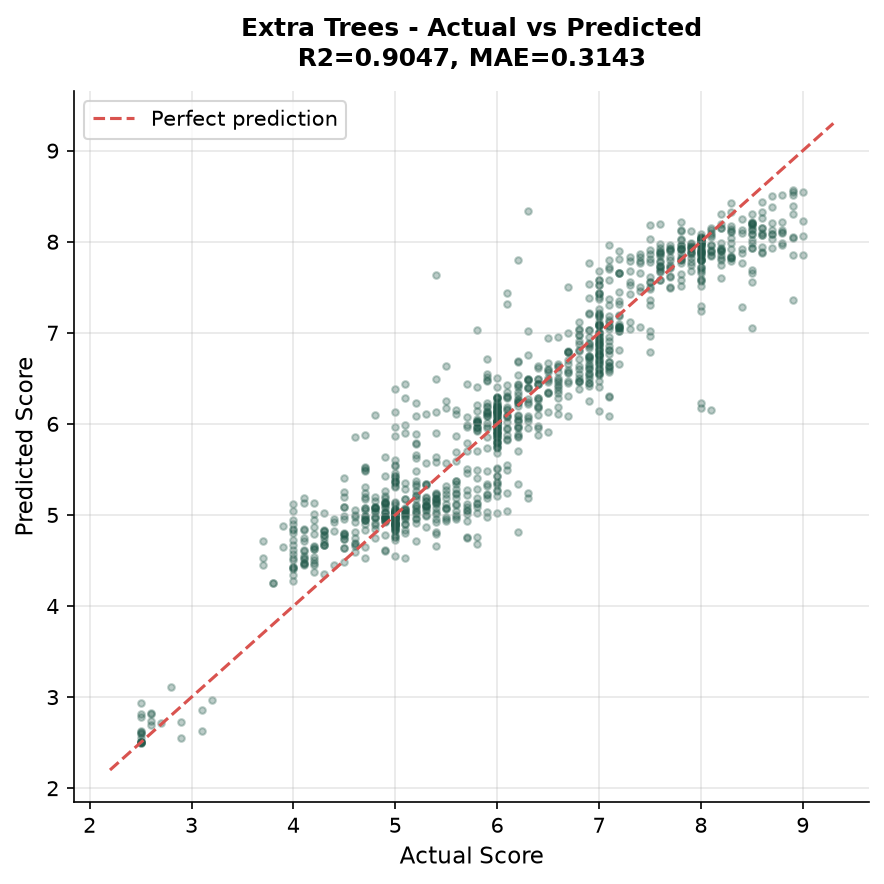
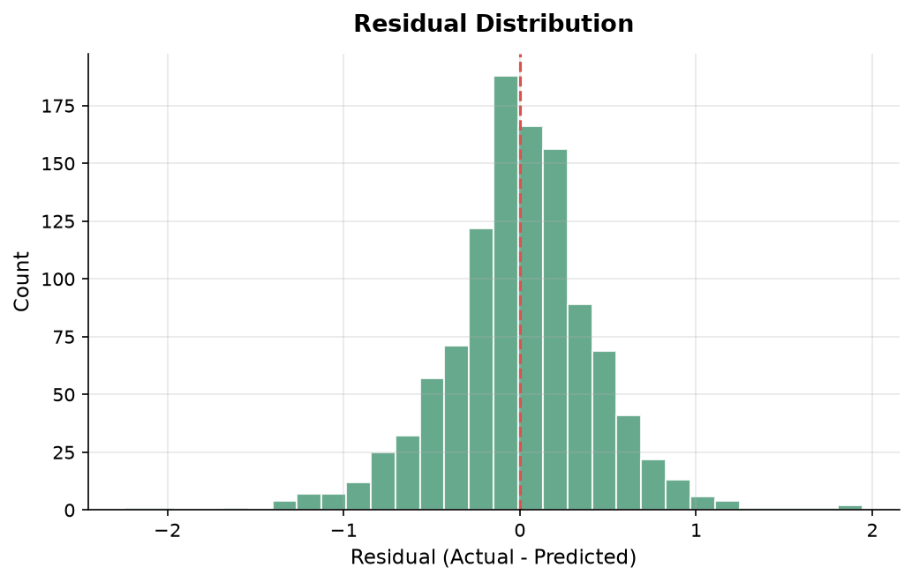

# Student Mental Health

A machine learning web application that predicts a student's mental health score based on social media usage, academic workload, sleep, physical activity, and stress level.

**Built as part of a college Machine Learning course.**

---

## Abstract

Student mental health is increasingly influenced by digital habits — screen time, phone unlocks, social media platform choice, and sleep deprivation all play a role. This project explores whether a machine learning model can predict a student's mental health score from these daily patterns, and serve that prediction through a custom web application.

The application uses a **Gradient Boosting Regressor** trained on survey data from ~5,000 students, with 5 engineered interaction features and 500 synthetic extreme cases to handle out-of-range inputs. The model achieves an **R² score of 0.893** with **~10ms** prediction latency.

Instead of using Streamlit or similar ML-specific frameworks, this project was built with a **vanilla HTML/CSS/JS frontend** and a **FastAPI backend** — to learn how ML models integrate into real web applications from scratch.

---

## Objectives

- Train and compare multiple regression models (Linear, Ridge, Decision Tree, Random Forest, Gradient Boosting, Extra Trees)
- Engineer meaningful interaction features from raw student data
- Handle edge cases (out-of-range inputs) using synthetic data augmentation
- Deploy the trained model into a custom web frontend without ML-specific frameworks
- Build a clean, responsive UI with client-side validation and real-time feedback

---

## Tech Stack

| Component | Technology |
|-----------|-----------|
| Frontend | HTML5, CSS3, Vanilla JavaScript |
| Backend | FastAPI, Pydantic |
| ML Model | scikit-learn (Gradient Boosting Regressor) |
| Serialization | joblib |
| Hosting | Render (backend) |

---

## Project Structure

```
student-mental-health/
├── main.py                   # FastAPI server — loads model, serves /predict endpoint
├── Mental_Health_Model.pkl   # Trained pipeline (preprocessing + model, 3.8 MB)
├── ML_Project.ipynb          # Jupyter notebook — EDA, training, evaluation
├── index.html                # Frontend — form UI, gauge, result display
├── script.js                 # Form handling, API calls, validation, animations
├── style.css                 # All styling (no CSS frameworks)
├── requirements.txt          # Python dependencies
├── docs/                     # Plots and screenshots
│   ├── model_comparison.png
│   ├── actual_vs_predicted.png
│   └── residual_distribution.png
└── Student Social Media And Mental Health Impact.csv   # Dataset
```

---

## Dataset

**[Student Social Media and Mental Health Impact](https://www.kaggle.com/datasets/shivasingh4945/student-social-media-and-mental-health-impact)** — 5,000 student responses with 13 features:

- **Demographics:** Age, Gender, Country
- **Social Media:** Platform, Daily Usage Hours, Phone Unlocks
- **Lifestyle:** Study Hours, Physical Activity, Sleep
- **Mental Health:** Stress Level (Low/Medium/High/Very High), Mental Health Score (0–10)

The original dataset covers ages 18–24 with sleep ranging 3.6–9.9 hours. Synthetic extreme cases were added to extend this range for real-world robustness.

---

## Methodology

### 1. Data Cleaning
- Removed 2 duplicate rows
- Clipped negative `Physical_Activity_Hours` values to 0

### 2. Synthetic Data Augmentation
The real dataset only covers ages 18–24, sleep 3.6–9.9 hours, and screen time 1–8.8 hours. To handle younger students or extreme cases (age=10, sleep=2 hours), 500 synthetic rows were generated using domain-informed formulas:

- **Extreme bad:** High screen time, low sleep, high stress → score 2.5–5.0
- **Extreme good:** Low screen time, high sleep, low stress → score 7.0–9.5
- **Moderate:** Mixed patterns → score 3.5–8.5

### 3. Feature Engineering
5 interaction features were created to capture relationships between raw variables:

| Feature | Formula | Rationale |
|---------|---------|-----------|
| `Screen_Sleep_Ratio` | screen_time / sleep | High ratio = screen replacing sleep |
| `Screen_Study_Ratio` | screen_time / study | Screen competing with study time |
| `Unlocks_Per_Hour` | unlocks / screen_time | Phone dependency intensity |
| `Lifestyle_Balance` | (study + activity) / screen_time | Productive time vs. screen time |
| `Sleep_Activity_Balance` | sleep + activity | Combined recovery metric |

### 4. Country Grouping
111 unique countries were reduced to top 10 + "Other" to prevent high cardinality issues.

### 5. Preprocessing Pipeline
- **Log transform** for skewed features (Study_Hours, ratios)
- **StandardScaler** for all numeric features
- **OrdinalEncoder** for stress level (Low < Medium < High < Very High)
- **OneHotEncoder** for categorical features (Gender, Platform, Purpose, etc.)

### 6. Model Comparison

| Model | Test R² | MAE | RMSE |
|-------|---------|-----|------|
| Linear Regression | ~0.75 | ~0.65 | ~0.80 |
| Ridge Regression | ~0.75 | ~0.65 | ~0.80 |
| Decision Tree | ~0.80 | ~0.55 | ~0.70 |
| Random Forest | ~0.88 | ~0.37 | ~0.48 |
| **Gradient Boosting** | **0.893** | **0.341** | **0.455** |
| Extra Trees | ~0.91 | ~0.33 | ~0.44 |

Gradient Boosting was selected over Extra Trees despite slightly lower R², because:
- **Model size:** 3.8 MB vs 67.5 MB
- **Latency:** ~10ms vs ~430ms per prediction
- Better suited for web deployment

### 7. Final Model Configuration

```
GradientBoostingRegressor(
    n_estimators=500,
    max_depth=6,
    learning_rate=0.08,
    subsample=0.8,
    random_state=42
)
```

---

## Model Plots

### Model Comparison


### Actual vs Predicted


### Residual Distribution


---

## Score Interpretation

| Score Range | Signal Level | Description |
|:-----------:|:------------:|-------------|
| 0 – 3.9 | **Strained** | Elevated strain — small shifts in sleep or screen time can help |
| 4 – 5.9 | **Moderate** | Some balance, but room to build healthier habits |
| 6 – 7.9 | **Balanced** | Fairly steady rhythm, with room to recover and reset |
| 8 – 10 | **Strong** | Well-supported, resilient baseline — keep it up |

---

## How to Run

### Prerequisites
- Python 3.10+
- pip

### Setup

```bash
# Clone the repository
git clone https://github.com/dadhichmohak/student-mental-health.git
cd student-mental-health

# Install dependencies
pip install -r requirements.txt

# Start the backend server
python -m uvicorn main:app --port 2200 --reload
```

> **Note:** Use `python -m uvicorn` instead of just `uvicorn` to avoid PATH issues on Windows.

### Open the Frontend

Double-click `index.html` in your browser. The frontend auto-detects `localhost` and connects to the backend.

---

## API Reference

The backend exposes a single prediction endpoint.

**Base URL:** `http://127.0.0.1:2200`

### `POST /predict`

**Request Body:**

```json
{
  "age": 21,
  "gender": "Female",
  "country": "Canada",
  "academic_level": "Undergraduate",
  "most_used_platform": "LinkedIn",
  "purpose_of_use": "Education",
  "avg_daily_usage_hours": 2.0,
  "daily_unlocks": 80,
  "study_hours": 6.0,
  "physical_activity_hours": 3.0,
  "sleep_hours_per_night": 8.0,
  "stress_level": "Low"
}
```

**Response:**

```json
{
  "predicted_mental_health_score": 7.79
}
```

Interactive API docs are available at `http://127.0.0.1:2200/docs` when the server is running.

---

## Input Features

| Feature | Type | Range / Options |
|---------|------|-----------------|
| `age` | Numeric | 10–100 |
| `gender` | Categorical | Male, Female |
| `country` | Text | Any (grouped into top 10 + Other) |
| `academic_level` | Categorical | High School, Undergraduate, Graduate |
| `most_used_platform` | Categorical | Instagram, TikTok, YouTube, LinkedIn, etc. |
| `purpose_of_use` | Categorical | Entertainment, Education, Networking, News |
| `avg_daily_usage_hours` | Numeric | 0–24 hrs |
| `daily_unlocks` | Numeric | 0+ |
| `study_hours` | Numeric | 0–24 hrs |
| `physical_activity_hours` | Numeric | 0–24 hrs |
| `sleep_hours_per_night` | Numeric | 0–24 hrs |
| `stress_level` | Ordinal | Low, Medium, High, Very High |

---

## Model Performance

| Metric | Value |
|--------|-------|
| R² Score | 0.893 |
| MAE | 0.341 |
| RMSE | 0.455 |
| Model Size | 3.8 MB |
| Prediction Latency | ~10 ms |

---

## Frontend Features

- **Custom form UI** with field-level validation and error messages
- **Stress level selector** — segmented control with contextual hints
- **Signal legend** — shows all 4 score bands with color-coded dots before prediction
- **Gauge visualization** — animated SVG semicircle with gradient fill
- **Responsive design** — works on desktop and mobile
- **Client-side validation** — mirrors backend Pydantic checks

---

## Screenshots

> Place screenshots in the `docs/` folder.

| Form | Result |
|:----:|:------:|
|  |  |

---

## Limitations

- The model is trained on survey data, not clinical assessments
- Only two gender options available (Male/Female) — limited by the dataset
- Synthetic data is formula-based, not collected from real extreme cases
- Country grouping loses granularity for less-represented countries

---

## Future Improvements

- Add more demographic features (income, education level, occupation)
- Include time-series data (weekly patterns instead of daily averages)
- Implement model retraining pipeline with new data
- Add a confidence interval to predictions
- Support more gender identities if dataset allows

---

## Disclaimer

This is **not** a diagnostic tool. The score is a pattern-based estimate from survey data, not a clinical assessment. If you're struggling, please talk to someone you trust.

---

## References

- Dataset: [Kaggle — Student Social Media and Mental Health Impact](https://www.kaggle.com/datasets/shivasingh4945/student-social-media-and-mental-health-impact)
- [FastAPI Documentation](https://fastapi.tiangolo.com/)
- [scikit-learn Documentation](https://scikit-learn.org/)

---

## License

This project is for educational purposes only.
